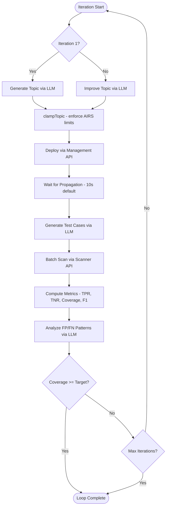

# Core Loop

The core loop lives in `src/core/loop.ts` and is implemented as an async generator (`runLoop()`) that yields typed `LoopEvent` discriminated unions. This design fully decouples the iteration engine from the CLI renderer, making the loop independently testable.

## Iteration Flowchart

Each iteration follows a fixed sequence of stages:



## Event Types

The generator yields events at each stage of the loop. Consumers (e.g., the CLI renderer) iterate the generator and dispatch on the event `type` field.

### Yielded by `runLoop()`

| Event | Payload | When |
|-------|---------|------|
| `iteration:start` | iteration number | Start of each iteration |
| `generate:complete` | `CustomTopic` | After LLM generates or improves topic |
| `apply:complete` | topic ID | After topic deployed to AIRS (yielded but intentionally unhandled in CLI) |
| `tests:accumulated` | new count, total count, dropped count | After test accumulation merges new + old tests (only when `accumulateTests` enabled, iteration 2+) |
| `test:progress` | completed count, total | Per-test scan completion |
| `evaluate:complete` | `EfficacyMetrics` | After metrics computed |
| `analyze:complete` | `AnalysisReport` | After FP/FN analysis |
| `iteration:complete` | `IterationResult` | Full iteration summary |
| `memory:extracted` | learning count | Learnings extracted post-loop (only if memory enabled) |
| `loop:complete` | best iteration, run state | Terminal: target reached or max iterations |

### Defined but not yielded by `runLoop()`

| Event | Payload | Status |
|-------|---------|--------|
| `loop:paused` | current state | Reserved for future use — not currently yielded |
| `memory:loaded` | learning count | Emitted by CLI command (`generate.ts`) before the loop starts, not by the generator itself |

!!! tip "Terminal Events"
    `loop:complete` is the terminal event. After it is yielded, the generator returns and no further events are produced. `loop:paused` is defined in the type union for future use but is not currently yielded.

## Topic Name Locking

The topic name is generated once during **iteration 1** and locked for all subsequent iterations. Only the description and examples are refined in later iterations.

This prevents two problems:

- **Identity thrashing** -- changing the topic name on each iteration would create new AIRS entities instead of updating the existing one.
- **Entity inconsistency** -- downstream profile references depend on a stable topic identity.

!!! warning "Name Immutability"
    The loop enforces name locking internally. Even if the LLM returns a different name in its improvement output, the original name from iteration 1 is preserved.

## Stop Conditions

The loop terminates when either condition is met:

| Condition | Default | Description |
|-----------|---------|-------------|
| Coverage target reached | `0.9` (90%) | `coverage = min(TPR, TNR)` must meet or exceed `targetCoverage` |
| Max iterations exceeded | `20` | Hard upper bound on refinement cycles |

!!! info "Coverage Definition"
    Coverage is defined as `min(TPR, TNR)`, not a simple average. This ensures both true-positive and true-negative performance must reach the target -- the system cannot pass by excelling at one while failing the other.

## Four LLM Calls Per Iteration

Each iteration makes up to four LLM calls, all using `withStructuredOutput(ZodSchema)`:

1. **Generate / Improve Topic** -- produces a `CustomTopic` (name, description, examples)
2. **Generate Test Cases** -- produces positive and negative test prompts
3. **Analyze Results** -- examines false positives and false negatives for patterns (intent-aware: prioritizes FN reduction for block, FP reduction for allow)
4. *(Post-loop)* **Extract Learnings** -- distills iteration history into reusable memory entries

## Test Accumulation

By default, test prompts are regenerated fresh each iteration. When `accumulateTests` is enabled in `UserInput`, tests carry forward across iterations:

- **Deduplication**: case-insensitive by prompt text, new tests take priority over old
- **Max cap**: optional `maxAccumulatedTests` limits total count, keeping newest first
- **Event**: `tests:accumulated` is yielded on iterations 2+ with new/total/dropped counts

```typescript
const input: UserInput = {
  // ...
  accumulateTests: true,
  maxAccumulatedTests: 50, // optional cap
};
```

!!! info "Regression Detection"
    Accumulation ensures prompts that triggered false positives/negatives in earlier iterations remain in the test pool, enabling regression detection when the topic definition changes.
