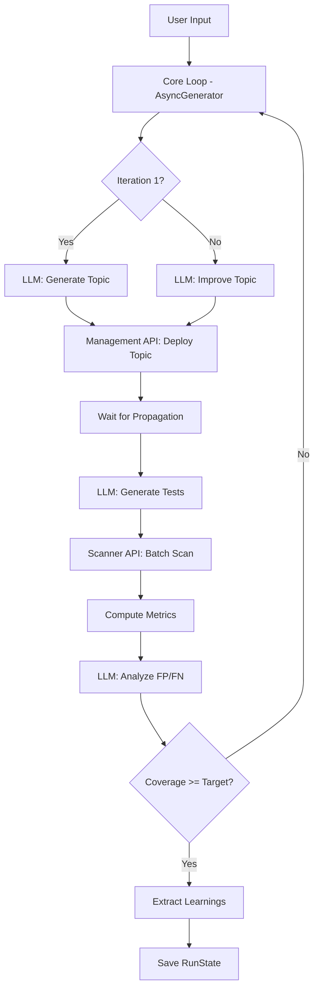

# Architecture Overview

Daystrom is an automated CLI that generates, tests, and iteratively refines **Palo Alto Prisma AIRS custom topic guardrails** using LLMs. This page describes the high-level module structure, data flow, and technology choices.

## Module Structure

```
src/
├── cli/              CLI entry, commands (generate/resume/report/list), prompts, renderer
├── config/           Zod-validated config schema + env/file/CLI cascade loader
├── core/             Async generator loop, efficacy metrics, AIRS topic constraints
├── llm/              LangChain provider factory, structured output service, prompt templates
├── airs/             Scanner (sync scan + batch) and Management (CRUD + profile linking)
├── memory/           Learning store, extractor, budget-aware injector, iteration diff
├── persistence/      JSON file store for run state
└── index.ts          Library exports
```

## Data Flow

The following diagram traces a user request through the full generate-test-refine loop:



!!! info "Propagation Delay"
    After deploying a topic via the Management API, the system waits a configurable delay (default 10 seconds) before scanning. AIRS requires propagation time before newly created or updated topics take effect.

## Module Descriptions

| Module | Key Files | Role |
|--------|-----------|------|
| `cli/` | `index.ts`, `commands/`, `prompts.ts`, `renderer.ts` | Commander CLI with 4 commands, Inquirer interactive prompts, Chalk terminal rendering |
| `config/` | `schema.ts`, `loader.ts` | Zod `ConfigSchema` with coercion and defaults; cascade loader (CLI > env > file > Zod defaults) |
| `core/` | `loop.ts`, `metrics.ts`, `constraints.ts`, `types.ts` | AsyncGenerator loop yielding typed events, TPR/TNR/F1 metric computation, AIRS constraint validation |
| `llm/` | `provider.ts`, `service.ts`, `schemas.ts`, `prompts/` | LangChain provider factory (6 providers), structured output with Zod schemas, prompt templates |
| `airs/` | `scanner.ts`, `management.ts`, `types.ts` | Scan API with p-limit batch concurrency, Management API for topic CRUD + profile linking via OAuth2 |
| `memory/` | `store.ts`, `extractor.ts`, `injector.ts`, `diff.ts` | File-based learning store, LLM-driven extraction, budget-aware prompt injection, iteration diffs |
| `persistence/` | `store.ts`, `types.ts` | `JsonFileStore` for `RunState` serialization at `~/.daystrom/runs/` |

## Tech Stack

| Category | Technology |
|----------|-----------|
| Language | TypeScript ESM, Node 20+ |
| Package Manager | pnpm |
| LLM Integration | LangChain.js with structured output (Zod schemas) |
| AIRS SDK | `@cdot65/prisma-airs-sdk` for scan and management APIs |
| CLI Framework | Commander.js |
| Interactive Prompts | Inquirer |
| Terminal Rendering | Chalk |
| Testing | Vitest + MSW |
| Lint / Format | Biome |

!!! note "Supported LLM Providers"
    Six providers are supported out of the box: `claude-api` (default), `claude-vertex`, `claude-bedrock`, `gemini-api`, `gemini-vertex`, and `gemini-bedrock`. The default model is `claude-opus-4-6`.
