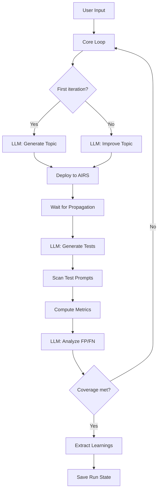

# Architecture Overview

Daystrom follows a modular architecture where each subsystem has a single responsibility. The core loop orchestrates everything but has no knowledge of how its output is displayed, stored, or consumed.

## Module Structure

```
src/
├── cli/              Commands, interactive prompts, terminal rendering
├── config/           Zod-validated config schema + cascade loader
├── core/             Async generator loop, efficacy metrics, AIRS constraints
├── llm/              LangChain provider factory, structured output, prompts
├── airs/             Scanner (batch scan) and Management (topic CRUD + profiles)
├── memory/           Learning store, extractor, budget-aware injector
├── persistence/      JSON file store for run state
└── index.ts          Library re-exports
```

## Data Flow

A single `daystrom generate` run flows through these stages:



!!! info "Propagation delay"
    After deploying a topic, Daystrom waits a configurable delay (default 10s) before scanning. AIRS needs this time to propagate changes.

## Modules at a Glance

| Module | What it does |
|--------|-------------|
| **`cli/`** | Commander CLI with 4 commands (`generate`, `resume`, `report`, `list`), Inquirer prompts, and Chalk terminal output |
| **`config/`** | Zod schema with coercion and defaults; cascade loader merges CLI flags, env vars, config file, and defaults |
| **`core/`** | AsyncGenerator loop that yields typed events, metric computation (TPR/TNR/F1), and AIRS constraint validation |
| **`llm/`** | Factory for 6 LangChain providers, structured output with Zod schemas, and prompt templates for all 4 LLM calls |
| **`airs/`** | Scan API with batched concurrency via `p-limit`, Management API for topic CRUD and profile linking via OAuth2 |
| **`memory/`** | File-based learning store, LLM-driven extraction after each run, and budget-aware injection into future prompts |
| **`persistence/`** | `JsonFileStore` serializes `RunState` to `~/.daystrom/runs/` for pause/resume support |

## Tech Stack

| Category | Technology |
|----------|-----------|
| Language | TypeScript ESM, Node 20+ |
| Package Manager | pnpm |
| LLM Integration | LangChain.js with structured output (Zod schemas) |
| AIRS SDK | `@cdot65/prisma-airs-sdk` |
| CLI | Commander.js + Inquirer + Chalk |
| Testing | Vitest + MSW (fully offline) |
| Lint / Format | Biome |

!!! note "Supported LLM Providers"
    Six providers out of the box: `claude-api` (default), `claude-vertex`, `claude-bedrock`, `gemini-api`, `gemini-vertex`, `gemini-bedrock`. Default model: `claude-opus-4-6`.
