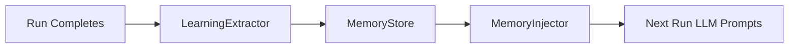

# Memory System

Cross-run learning memory that extracts, stores, and injects learnings across guardrail generation runs. Learnings from one topic improve future runs on similar topics.



## How Learnings Work

After each run completes, the `LearningExtractor` sends the full iteration history to the LLM for analysis. The LLM produces structured `Learning` objects:

| Field | Description |
|-------|-------------|
| `insight` | Actionable observation from the run |
| `strategy` | How to apply the insight in future runs |
| `outcome` | `improved` \| `degraded` \| `neutral` |
| `changeType` | `description-only` \| `examples-only` \| `both` \| `initial` |
| `corroborations` | Count of runs confirming this learning (starts at 0, increments on rediscovery) |
| `tags` | Metadata for filtering and display |

!!! info "Corroboration"
    When a new run rediscovers an existing learning, the corroboration count increments rather than creating a duplicate. Higher corroboration = higher injection priority.

## Keyword-Based Categorization

Topic descriptions are normalized to keyword-based category strings:

1. Lowercase the description
2. Strip punctuation
3. Remove stop words
4. Sort remaining words alphabetically
5. Join with hyphens

**Example:** `"Block weapons discussions"` → `block-discussions-weapons`

Each category maps to a separate memory file on disk.

## Cross-Topic Transfer

Learnings are injected for any topic whose keyword set has **≥50% overlap** with the stored category.

!!! example "Transfer Example"
    Learnings from `"Block weapons discussions"` (`block-discussions-weapons`) transfer to `"Block violence and weapons"` (`block-violence-weapons`) because the keyword overlap exceeds 50%.

This enables knowledge reuse across related guardrail topics without requiring exact matches.

## Budget-Aware Injection

The injector operates within a configurable character budget (default **3000 chars**, range 500–10000). Learnings are sorted by corroboration count descending, then rendered in three tiers:

### Tier 1 — Verbose

Full metadata included when budget allows:

```
- [DO] Use specific action verbs in examples (description-only, seen 4x)
- [AVOID] Overly generic descriptions that match benign prompts (both, seen 3x)
```

### Tier 2 — Compact

Insight only, when verbose format would exceed budget:

```
- [DO] Use specific action verbs in examples
- [AVOID] Overly generic descriptions that match benign prompts
```

### Tier 3 — Omitted

When even compact format doesn't fit:

```
(+5 more learnings omitted)
```

!!! note
    Anti-patterns are appended after learnings if remaining budget allows.

## Best-Known Tracking

The memory store tracks the best topic definition and metrics for each category. This allows comparison across runs — if a new run produces worse results, the best-known definition is preserved for reference.

## Storage

All memory files are stored at:

```
~/.daystrom/memory/{category}.json
```

Each file contains the learnings array, best-known topic, and best-known metrics for that category.
