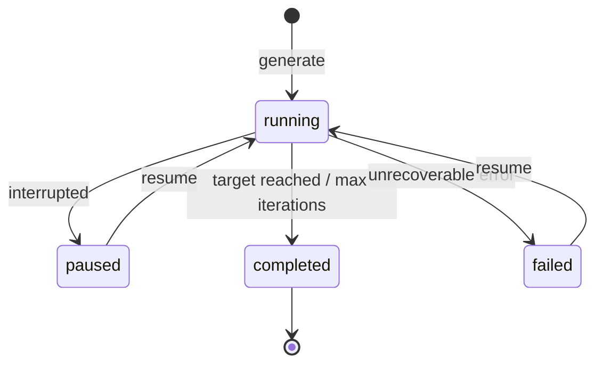

# Resumable Runs

Runs can be paused (via interruption) or fail mid-execution and later be resumed from the last completed iteration.

## Run Lifecycle



| Status | Meaning |
|--------|---------|
| `running` | Loop actively iterating |
| `paused` | Loop was interrupted (Ctrl+C or signal) |
| `completed` | Target coverage reached or max iterations exhausted |
| `failed` | Unrecoverable error during iteration |

!!! info "Resumable Statuses"
    Only `paused` and `failed` runs can be resumed. Completed runs are final.

## Persistence

Full `RunState` is persisted to disk after each iteration:

```
~/.daystrom/runs/{runId}.json
```

The saved state includes:

| Field | Description |
|-------|-------------|
| `runId` | Unique identifier |
| `status` | Current lifecycle status |
| `userInput` | Original user configuration |
| `iterations` | Array of all completed iteration results |
| `bestIteration` | Index of iteration with highest coverage |
| `currentTopic` | Latest topic definition |
| `createdAt` / `updatedAt` | Timestamps |

!!! tip
    Because full state is saved after each iteration, no work is lost on interruption. The next `resume` picks up exactly where the run left off.

## Resuming a Run

```bash
pnpm run dev resume <runId>
```

### Options

| Flag | Description |
|------|-------------|
| `--max-iterations <n>` | Number of **additional** iterations from current position |

```bash
# Resume with up to 10 more iterations
pnpm run dev resume abc123 --max-iterations 10
```

The resumed run continues with:

- The same topic name (locked after iteration 1)
- The latest topic definition from the last completed iteration
- All prior iteration history for context

## Viewing Results

### List All Runs

```bash
pnpm run dev list
```

Displays a summary table of all saved runs with ID, status, topic name, iterations completed, best coverage, and timestamps.

### View Run Report

```bash
# Best iteration (highest coverage)
pnpm run dev report <runId>

# Specific iteration
pnpm run dev report <runId> --iteration 3
```

Reports show the topic definition, test results, metrics, and analysis for the selected iteration.
