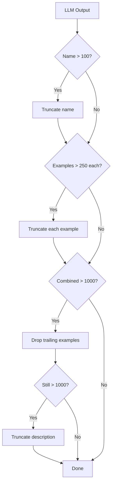

# Topic Constraints

Palo Alto Prisma AIRS enforces hard limits on custom topic definitions. Daystrom handles these constraints automatically so the LLM can generate freely without truncation concerns.

## Limits

| Field | Max Length |
|-------|-----------|
| **Name** | 100 characters |
| **Description** | 250 characters |
| **Each example** | 250 characters |
| **Max examples** | 5 |
| **Combined** (description + all examples) | 1000 characters |

!!! warning "UTF-8 Byte Length"
    All length checks use UTF-8 byte length, not character count. Multi-byte characters (emoji, non-ASCII) consume more than one unit toward the limit.

## Automatic Clamping

The LLM frequently exceeds the 250-character description limit — natural language descriptions tend to be verbose. The `clampTopic()` function in `src/llm/service.ts` enforces limits automatically after every LLM call:

1. **Truncate name** to 100 characters (rare — names are usually short)
2. **Truncate each example** to 250 characters
3. **If combined > 1000**: drop trailing examples one by one until under limit
4. **If still over 1000**: truncate description to fit remaining budget

!!! note "Why Post-LLM, Not Zod"
    Clamping is applied after the LLM generates output, not via Zod schema validation. The LLM needs freedom to produce natural descriptions, and the clamping logic (priority-based truncation, example dropping) is more nuanced than schema constraints can express.

## Validation

`src/core/constraints.ts` exports two sets of functions:

| Function | Behavior |
|----------|----------|
| **Validation** | Checks all limits, returns an array of error strings. Non-destructive. |
| **Clamping** | Silently enforces all limits by truncating and dropping as needed. Destructive. |

Use validation for diagnostics and testing. Use clamping in the production pipeline to ensure every topic submitted to AIRS is within bounds.

## Topic Name Locking

!!! info
    After iteration 1, the topic **name is locked** — only the description and examples change in subsequent iterations. This prevents AIRS sync issues from name changes mid-run.
