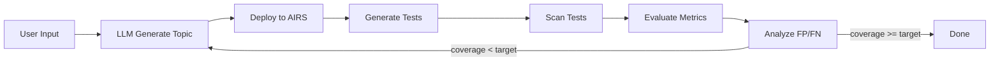

# Daystrom

**Daystrom** is an automated CLI that generates, tests, and iteratively refines custom topic guardrails for Palo Alto Prisma AIRS. Named after Star Trek's Dr. Richard Daystrom -- creator of the M-5 multitronic unit -- Daystrom embodies the same ambition: delegate complex, repetitive reasoning to an intelligent system so humans can focus on intent rather than implementation.

Given a natural-language description of what should be blocked or allowed, Daystrom uses an LLM to produce topic definitions (name, description, examples), deploys them to Prisma AIRS, generates targeted test prompts, scans those prompts against the live service, evaluates efficacy metrics (TPR, TNR, coverage, F1), analyzes false positives and negatives, and loops back to improve the topic until a coverage target is met. Cross-run memory persists learnings so every subsequent run benefits from past experience.

---

## How It Works

---

## Feature Highlights

!!! tip "Iterative Refinement"
    Automatically analyzes false positives and false negatives after each iteration, feeding structured feedback to the LLM to improve topic definitions until the target coverage threshold is reached.

!!! tip "Multi-Provider LLM"
    Supports six LLM provider configurations out of the box: Claude API, Claude Vertex, Claude Bedrock, Gemini API, Gemini Vertex, and Gemini Bedrock. Switch providers with a single config change.

!!! tip "Cross-Run Memory"
    File-based learning store persists insights across runs. Learnings are categorized by keyword overlap and injected into future prompts with a budget-aware strategy, so the LLM avoids repeating past mistakes.

!!! tip "Resumable Runs"
    Every iteration checkpoints run state to disk. If a run fails or is paused, resume it from exactly where it left off -- no wasted API calls or lost progress.

---

## Quick Links

| | |
|---|---|
| **[Getting Started](getting-started/installation.md)** | Install prerequisites, configure credentials, and run your first guardrail generation. |
| **[Architecture](architecture/overview.md)** | Understand the core loop, AIRS integration, LLM service, and memory system. |
| **[CLI Reference](reference/cli-commands.md)** | Full command reference for `generate`, `resume`, `report`, and `list`. |
