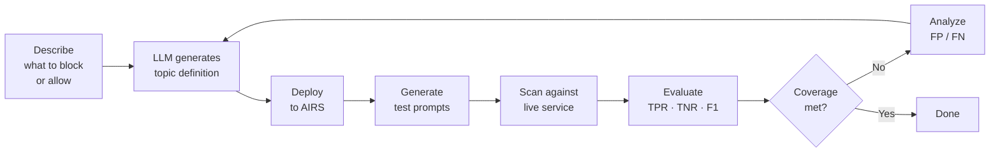

{ .hero-logo }

# Daystrom

**Automated guardrail generation for Palo Alto Prisma AIRS**

---

Daystrom is a CLI tool that takes a plain-English description of what you want to block or allow, then **automatically generates, tests, and refines** a custom topic guardrail until it meets your coverage target. Named after Star Trek's Dr. Richard Daystrom, it delegates the tedious cycle of write-deploy-test-improve to an LLM so you can focus on intent.

-   :material-refresh-auto:{ .lg .middle } **Iterative Refinement**

    ---

    Analyzes false positives and negatives after each iteration, feeding structured feedback to the LLM until coverage meets your threshold.

-   :material-brain:{ .lg .middle } **Multi-Provider LLM**

    ---

    Six provider configs out of the box — Claude API, Claude Vertex, Claude Bedrock, Gemini API, Gemini Vertex, and Gemini Bedrock.

-   :material-memory:{ .lg .middle } **Cross-Run Memory**

    ---

    Persists learnings across runs so the LLM avoids repeating past mistakes. Budget-aware injection keeps prompts focused.

-   :material-play-pause:{ .lg .middle } **Resumable Runs**

    ---

    Every iteration checkpoints to disk. Resume failed or paused runs from exactly where they left off — no wasted API calls.

-   :material-shield-check:{ .lg .middle } **Block & Allow Intent**

    ---

    First-class support for both block (blacklist) and allow (whitelist) guardrails with intent-aware test generation and analysis.

-   :material-test-tube:{ .lg .middle } **Test Accumulation**

    ---

    Optionally carry forward test prompts across iterations with dedup, catching regressions that fresh tests might miss.

-   :material-sword:{ .lg .middle } **AI Red Teaming**

    ---

    Launch static, dynamic, and custom adversarial scans against AI targets. Full CRUD on targets, prompt sets, and prompts via `daystrom redteam`.

    [:octicons-arrow-right-24: Red Team](features/red-team.md)

-   :material-clipboard-check:{ .lg .middle } **Profile Audits**

    ---

    Evaluate all topics in a security profile at once. Per-topic metrics, composite scores, and cross-topic conflict detection via `daystrom audit`.

-   :material-shield-lock:{ .lg .middle } **Model Security**

    ---

    Manage ML model supply chain security — security groups, rules, scans, evaluations, violations, and labels via `daystrom model-security`.

    [:octicons-arrow-right-24: Model Security](features/model-security.md)

---

## How It Works

---

## Get Started

-   :material-download:{ .lg .middle } **Install**

    ---

    Prerequisites, installation, and credential setup.

    [:octicons-arrow-right-24: Installation](getting-started/installation.md)

-   :material-rocket-launch:{ .lg .middle } **Quick Start**

    ---

    Run your first guardrail generation in minutes.

    [:octicons-arrow-right-24: Quick Start](getting-started/quick-start.md)

-   :material-cog:{ .lg .middle } **Configure**

    ---

    LLM providers, tuning parameters, and data locations.

    [:octicons-arrow-right-24: Configuration](getting-started/configuration.md)

-   :material-book-open-variant:{ .lg .middle } **Architecture**

    ---

    Core loop, AIRS integration, memory system, and design decisions.

    [:octicons-arrow-right-24: Architecture](architecture/overview.md)

